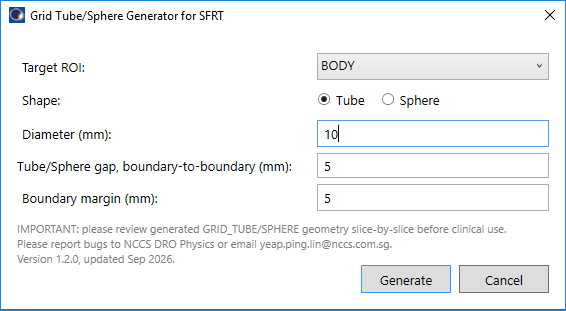
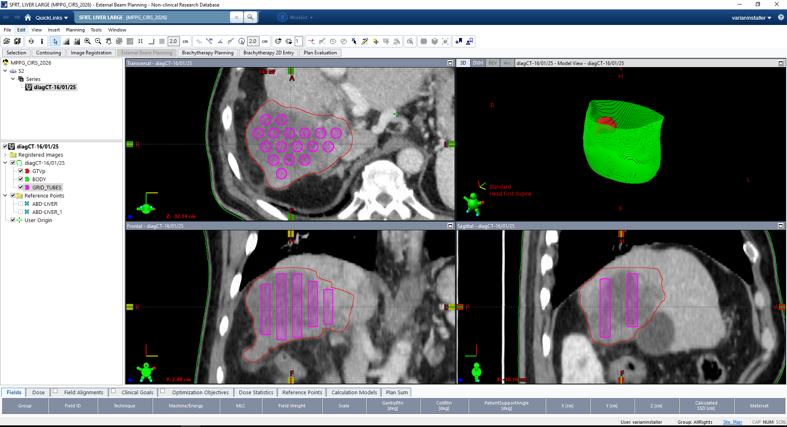
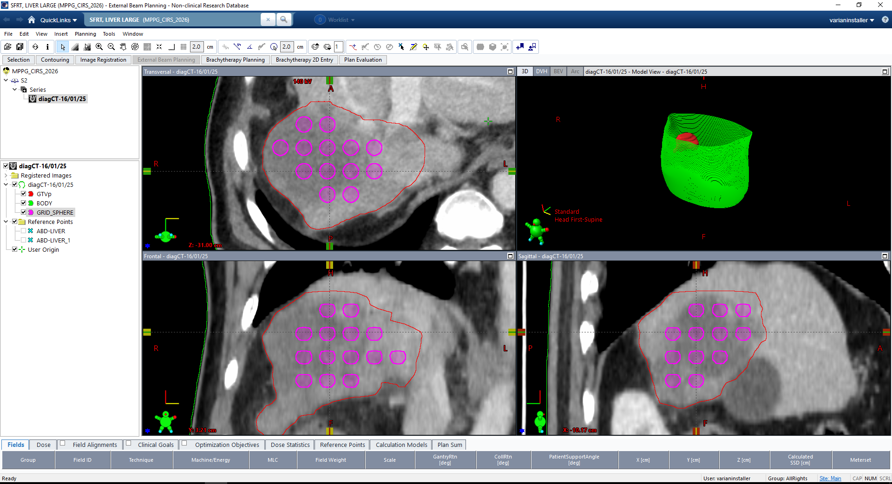

# SFRT Grid Tube/Sphere Generator (ESAPI)

An Eclipse Scripting API (ESAPI) script that generates a spatially
fractionated grid of either **tubes** (superior-inferior oriented cylinders)
or **spheres** inside a user-selected target ROI, for Spatially Fractionated
Radiation Therapy (SFRT) planning.

> **Clinical / validation notice**
> This is a template, not a commissioned or clinically validated tool.
> Review the generated geometry slice-by-slice (diameter, spacing, boundary
> clearance) before any clinical use. Confirm units, coordinate conventions,
> and structure behavior on your own Eclipse/ESAPI version before relying on
> this output.

---

## Files

| File                  | Purpose                                                             |
|------------------------|----------------------------------------------------------------------|
| `GridTubeGenerator.cs` | Entry point (`VMS.TPS.Script.Execute`) and all packing/geometry logic |
| `InputDialog.xaml`     | WPF window markup for the input dialog                              |
| `InputDialog.xaml.cs`  | Code-behind: input validation, returns selections to the script     |

All three files belong in the same Visual Studio project (Class Library,
with WPF assembly references added). See **Build & Install** below.

---

## Inputs

The script opens a dialog with the following fields:

| Field | Description |
|---|---|
| **Target ROI** | Dropdown of all structures in the current structure set. The ROI inside which tubes/spheres are generated. |
| **Shape** | `Tube` or `Sphere` (radio buttons, Tube is default). |
| **Diameter (mm)** | Diameter of each tube or sphere. Must be positive. |
| **Tube/Sphere gap (mm)** | The **boundary-to-boundary** (surface-to-surface) spacing between neighbouring tubes/spheres — *not* centre-to-centre. Must be positive. |
| **Boundary margin (mm)** | Minimum 3D distance required between the tube/sphere surface and the target ROI's boundary. Must be non-negative. |



### How gap becomes lattice spacing

Internally, the centre-to-centre lattice pitch is derived as:

```
pitch = diameter + gap
```

so "gap" always means the clear space between adjacent shapes, regardless of
diameter.

---

## Output

A single new structure is created in the current structure set, replacing
any existing structure of the same name:

- **`GRID_TUBES`** — if Tube was selected.
- **`GRID_SPHERE`** — if Sphere was selected.

Both are created with DICOM structure type `"CONTROL"` (change the
`AddStructure("CONTROL", ...)` call in the code if your clinic wants a
different type).

A message box reports how many segments/spheres were generated (and, for
tubes, total combined SI length) once the script finishes.

---

## How it works

Both modes share the same high-level idea: generate a regular lattice of
candidate positions, keep only the ones that are geometrically safe (inside
the target, with the required clearance from its boundary), and draw the
result as contours. They differ in lattice shape and how "safe" is tested,
because a tube's safe extent can vary continuously along its length while a
sphere is a fixed rigid volume.

### Coordinate frame & slice mapping

- The target ROI's bounding box is read from `Structure.MeshGeometry.Bounds`
  (a `Rect3D`), giving `xMin/xMax`, `yMin/yMax`, `zMin/zMax` in the same
  mm coordinate frame used by `VVector` and `Structure.IsPointInsideSegment`.
- Image slice index ↔ z-coordinate mapping uses:
  `z(i) = image.Origin.z + i * image.ZRes`
  Slice indices are always normalized to ascending order regardless of the
  sign of `image.ZRes`.

### Containment testing

Rather than re-deriving contour polygon math (point-in-polygon, edge
distances), the script uses ESAPI's native
`Structure.IsPointInsideSegment(VVector)` to test whether a given 3D point
lies inside the target's segmented volume. All boundary-margin enforcement
is done by sampling a **ring or sphere of test points** around a candidate
shape's surface (at radius = shape radius + boundary margin) and requiring
every sampled point, plus the center, to test as "inside".

### Tube mode

1. **Lattice**: candidate tube centers (x, y) are generated on a
   **hexagonal lattice** in-plane, with row spacing `pitch * sqrt(3) / 2`
   and alternating row offsets of `pitch / 2` (standard hex-close-packing
   layout, radius-only, not the full close-packed density since safety
   testing may reject many candidates).
2. **SI range trim**: the usable Z range is first shrunk by the boundary
   margin (`zMinTarget + margin` to `zMaxTarget - margin`), so tube ends are
   kept away from the target's superior/inferior extent as well as its
   in-plane boundary.
3. **Per-slice safety test**: for each candidate (x, y) and each candidate
   slice, `CircleSafetySamples` points (default 16) are sampled around a
   ring of radius `diameter/2 + margin` centered at (x, y) on that slice's
   z-plane, plus the center point itself. The slice is "safe" for that
   candidate only if every sampled point is inside the target.
4. **Segment extraction**: for each (x, y) candidate, the safe slice indices
   are split into contiguous runs (`SplitIntoContiguousSegments`). Runs
   shorter than `MinSegmentSlices` (default 2) are discarded as slivers.
   Each remaining run becomes one tube segment (fixed x, y; z spans the
   run's slice range).
5. **Multi-phase optimization**: the entire hex lattice is regenerated at
   `PhaseSearchSteps × PhaseSearchSteps` (default 3×3 = 9) phase offsets in
   x and y. Whichever phase yields the greatest **total summed SI length**
   across all accepted tube segments is kept; all others are discarded.
6. **Drawing**: for each accepted segment, a circular contour of radius
   `diameter/2` (no margin) is drawn via `AddContourOnImagePlane` on every
   slice in the segment's range.

This is geometrically equivalent to "cylinder ∩ inward-contracted target",
achieved without ever constructing a raw cylinder or doing structure
Boolean algebra — the circle is only drawn where the safety test already
confirmed it belongs.



### Sphere mode

1. **Lattice**: candidate sphere centers (x, y, z) are generated on a
   **simple-cubic 3D lattice** — pitch spacing along all three axes, no
   hexagonal close-packing (unlike tube mode's in-plane hex lattice). This
   is simpler but less dense than an FCC/HCP packing; see **Limitations**.
2. **Candidate box trim**: the 3D candidate-center search box is shrunk on
   all three axes by `diameter/2 + margin`, so obviously-invalid candidates
   are never generated.
3. **3D safety test**: each candidate center is tested once, as a whole
   rigid sphere — no per-slice logic. `SphereSafetySamples` points (default
   32) are distributed evenly over a unit sphere using the **Fibonacci
   sphere method**, scaled to radius `diameter/2 + margin`, and centered on
   the candidate. The candidate is accepted only if the center and every
   sampled point test as inside the target. Because sampling covers the
   full 3D surface, this enforces the boundary margin uniformly in every
   direction (in-plane and SI) in a single test — sphere mode does not need
   tube mode's separate SI-range trim step.
4. **Multi-phase optimization**: the cubic lattice is regenerated at
   `SpherePhaseSearchSteps³` (default 2×2×2 = 8) phase offsets in x, y, and
   z. Whichever phase yields the greatest **count of accepted spheres** is
   kept (all spheres are the same size, so count is equivalent to packed
   volume).
5. **Drawing**: for each accepted sphere, every image slice intersecting the
   sphere (`center.z ± radius`) gets a circular contour whose radius shrinks
   with distance from the sphere's equator:
   `localRadius = sqrt(radius² − dz²)`, where `dz` is the slice's distance
   from the sphere center. Slices where this would produce a radius below
   `MinSphereSliceRadiusMm` (default 0.1 mm) are skipped to avoid degenerate
   polygons at the poles.



---

## Tunable constants

These are not exposed in the input dialog but materially affect runtime and packing quality. They live in the
`#region Tunable constants` block near the top of `GridTubeGenerator.cs`:

| Constant | Default | Effect |
|---|---|---|
| `CircleSafetySamples` | 16 | Points sampled per slice, per tube candidate. Higher = more accurate margin enforcement, slower. |
| `SphereSafetySamples` | 32 | Points sampled over each sphere candidate's full 3D surface. Same trade-off as above. |
| `ContourPolygonPoints` | 32 | Resolution of the drawn circular contours (visual/dosimetric smoothness, not a safety parameter). |
| `PhaseSearchSteps` | 3 | Tube mode: N×N phase offsets tested (in-plane). Cost scales as N². |
| `SpherePhaseSearchSteps` | 2 | Sphere mode: N×N×N phase offsets tested. Cost scales as N³ — kept lower than tube mode for this reason. |
| `MinSegmentSlices` | 2 | Tube mode: minimum contiguous safe slices to keep a segment. |
| `MaxContiguousIndexGap` | 1 | Tube mode: max allowed slice-index gap when merging a segment (1 = strictly contiguous). |
| `MinSphereSliceRadiusMm` | 0.1 | Sphere mode: smallest local slice radius worth drawing. |

**Performance note:** runtime scales with (number of lattice candidates) ×
(number of phases) × (number of safety samples), and each safety sample is
one `IsPointInsideSegment` call. For large targets, fine slice spacing, or
small diameter/gap (→ many lattice candidates), consider lowering
`PhaseSearchSteps`/`SpherePhaseSearchSteps` first if the script is slow.

---

## Usage

1. In Eclipse, open the patient/plan and go to the Scripts menu.
2. Run **SFRTGridGenerator** (or whatever name your site's script listing
   shows it as).
3. In the dialog:
   - Select the **Target ROI**.
   - Choose **Tube** or **Sphere**.
   - Enter **Diameter**, **Tube/Sphere gap**, and **Boundary margin** (mm).
   - Click **Generate**.
4. On success, `GRID_TUBES` or `GRID_SPHERE` appears in the structure set.
   **Review it slice-by-slice** before using it in planning — check
   diameter, spacing, and boundary clearance visually against the target.

---

## Limitations & assumptions

- **Not clinically validated.** Treat this as a starting template.
- **Sphere packing uses a simple-cubic lattice**, not a denser FCC/HCP
  packing — for a given pitch, an FCC/HCP arrangement would generally fit
  more spheres. This was chosen for implementation simplicity; swapping in
  a closer-packed lattice would improve packing density at the cost of more
  complex candidate generation.
- **Approximate margin enforcement.** Both modes enforce the boundary
  margin via discrete point sampling (a ring for tubes, a Fibonacci-sphere
  set for spheres) rather than an exact continuous distance transform. Very
  concave target shapes or very coarse sample counts could in principle let
  a thin "finger" of the boundary slip between sample points. Increasing
  `CircleSafetySamples`/`SphereSafetySamples` tightens this at a
  performance cost.
- **Phase search is a discrete grid**, not a full optimization — it will
  usually improve packing over a single fixed phase but is not guaranteed
  to find the global optimum.
- **No beam's-eye-view (BEV) pruning.** Only anatomical packing constraints
  are considered; the script does not account for beam directions or
  collision/clearance with delivery hardware.
- **Structure type** for both outputs is hardcoded to `"CONTROL"`.

---

## Feedback

Report any bugs or submit feedback to NCCS DRO Physics <yeap.ping.lin@nccs.com.sg>
